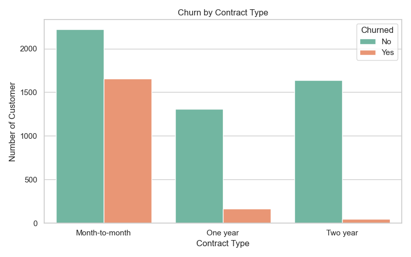
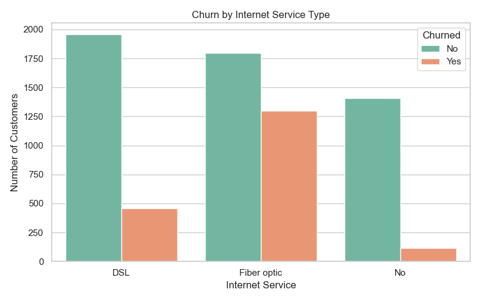
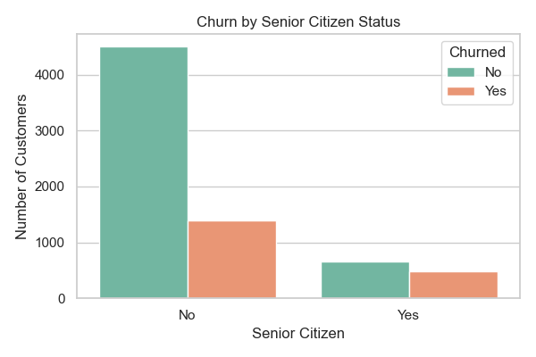
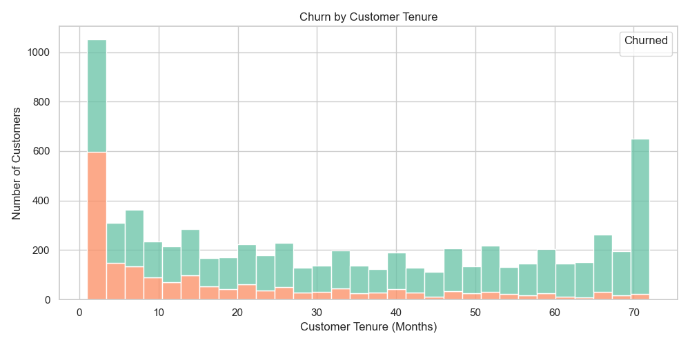
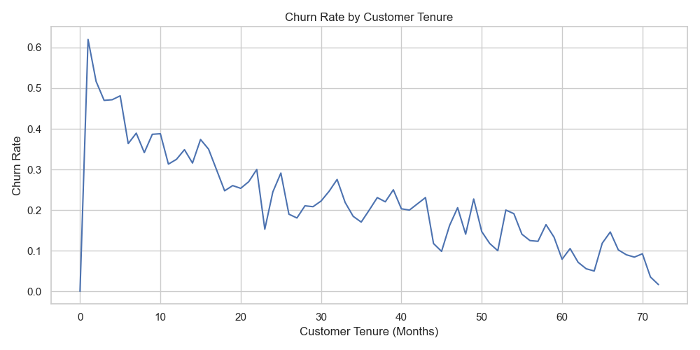
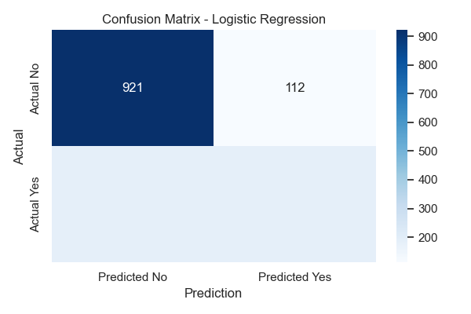
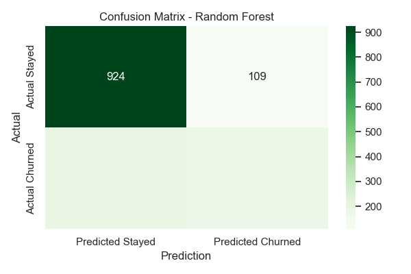

# Customer Churn Analysis – Telecom Industry

In the telecom industry, customer churn—the rate at which customers leave a service provider—can significantly impact a company’s revenue and growth. Understanding **why customers leave** and **who is most likely to leave** is crucial for building smart retention strategies.

This project dives into a real-world dataset from a telecom provider to:
- Identify key factors influencing churn
- Visualize trends and patterns across customer groups
- Build a predictive model to anticipate churn
- Provide clear, actionable recommendations to reduce customer loss

The analysis combines business thinking, data science techniques, and strong storytelling to help telecom stakeholders understand churn better and act on it.

**Dataset & Tools** 

- **Tools Used:** Python (Pandas, NumPy, Seaborn, Matplotlib, Scikit-learn, Jupyter Notebook)
- **Source:** [Kaggle – Telco Customer Churn Dataset](https://www.kaggle.com/datasets/blastchar/telco-customer-churn)
- **File:** `Telco_Customer_Churn.csv`
- **Total Records:** 7,043 → 7,032 after data cleaning
- **Features:**
  - Customer demographics (gender, senior citizen, dependents)
  - Services used (internet, phone, streaming, tech support)
  - Billing details (monthly charges, total charges, payment method)
  - Target variable: `Churn` (Yes/No)

1.Data Cleaning

- Converted `TotalCharges` to numeric and removed 11 invalid rows
- Standardized values (e.g., "No internet service" → "No") for clarity
- Encoded categorical values using LabelEncoder
- Removed `customerID`, which isn’t useful for prediction

2.Exploratory Data Analysis (EDA)

Key Findings:
Churn Rate: Out of 7,032 customers, 1,869 had churned, resulting in a churn rate of 26.58%. This highlights the scale of the churn problem.

Contract Type: Among month-to-month customers, the churn rate was 42%, whereas one-year contract customers had 11% churn and two-year contracts only 3%. This indicates that customers without long-term commitment are more likely to leave.

Monthly Charges: Customers who churned had a higher average monthly bill of $74.44, while those who stayed paid $61.31. This suggests pricing may influence churn.

Internet Service Type: Fiber optic users experienced a churn rate of 41%, compared to 19% for DSL and 7% for customers with no internet. This may indicate dissatisfaction with service quality or pricing among fiber users.

Tenure: Around 62% of churned customers had a tenure of 10 months or less, showing that early months are the most critical for retention.

Senior Citizens: Churn among senior citizens was 42%, notably higher than the 24% churn seen in non-seniors, pointing to potential service gaps for older customers.

---

**Visualizations & Business Insights**

1. Churn by Contract Type

**Insight:** Customers with month-to-month contracts are most vulnerable to churn. Incentivizing long-term plans could improve retention.

2. Churn by Internet Service Type

**Insight:** Fiber optic users churn more frequently. Investigate service quality or pricing concerns.

3. Churn by Senior Citizen Status

**Insight:** Seniors churn more—this segment may need clearer communication or simplified services.

5. Churn by Tenure Group

**Insight:** Churn risk is highest in the first 10 months. A strong onboarding experience can improve retention.

6. Churn Trend Over Time

**Insight:** Churn rate decreases as customers stay longer. Focus early on building loyalty to reduce attrition.

**Predictive Modeling Results**
We used two models to predict churn: Logistic Regression and Random Forest.

Logistic Regression (Final Model)
- **Accuracy**: 78.75%
- Best balance of simplicity and performance
- Easier to explain to non-technical stakeholders

**Classification Report:**
- Stayed → Precision: 0.83 | Recall: 0.89 | F1: 0.86
- Churned → Precision: 0.63 | Recall: 0.50 | F1: 0.56

Random Forest (for comparison)
- **Accuracy**: 78.25%
- Slightly lower recall for churned customers

**Overall Model result:** Logistic Regression slightly outperformed Random Forest and is easier to interpret. It was selected as the final model for churn prediction.

**Business Recommendations**

Based on the data and model results-
Strengthen Early-Stage Engagement: Since churn is highest in the first few months, create onboarding journeys and offer personalized deals to new customers.

Promote Annual Contracts: Encourage customers to commit to long-term plans by offering loyalty rewards or lower pricing.

Address Fiber Optic Dissatisfaction: Survey and monitor this customer segment closely to pinpoint performance or cost issues.

Design for Senior Citizens: Offer simplified interfaces, better support accessibility, and personalized plans for older users.

Monitor High-Billing Customers: Customers paying the most tend to churn more — this could signal mismatched value or pricing concerns.

**Conclusion**

This project highlighted key risk areas that influence customer churn and demonstrated how predictive modeling can help telecom companies respond before it's too late. Insights from the data showed that early-stage engagement, contract length, pricing, and service type are strong churn drivers.
Logistic Regression was chosen as the final model due to its clarity and balanced performance. The overall outcome confirms that even simple models paired with clear insights can drive meaningful business decisions.

Created by: Tabassum Arshad 
